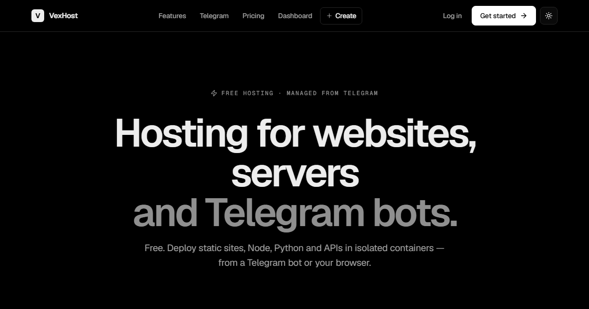
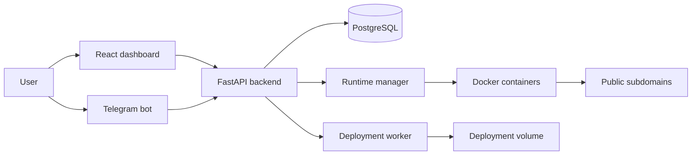

<p align="center">
  
</p>

<h1 align="center">VexHost</h1>

<p align="center">
  Free beta hosting for websites, APIs, servers, and Telegram bots.
</p>

<p align="center">
  <a href="https://host.vexory.xyz/">Live Beta</a>
  -
  <a href="https://t.me/VexHostBot">Telegram Bot</a>
  -
  <a href="#quick-start">Quick Start</a>
</p>

<p align="center">
  
  
  
</p>



## Beta Notice

VexHost is currently a beta project in active development. Some features are experimental, APIs and data models may change, and bugs or temporary downtime can happen. Use it for testing, early feedback, and small projects while the platform is being stabilized.

## What Is VexHost?

VexHost is a Telegram-first hosting platform for builders who want to publish projects quickly without setting up a full server workflow. It combines a web dashboard, Telegram bot access, Docker-based runtimes, live logs, file management, and basic monitoring in one lightweight stack.

Live beta: [https://host.vexory.xyz/](https://host.vexory.xyz/)

## Highlights

- Deploy static sites, Node.js apps, Python apps, APIs, Telegram bots, and Mini Apps.
- Manage projects from a browser dashboard or through `@VexHostBot`.
- Run app workloads in isolated Docker containers.
- Edit project files in the browser with a Monaco-powered editor.
- View deployment progress, runtime logs, CPU, RAM, disk, uptime, request, and error metrics.
- Restart, stop, and inspect running projects from the dashboard.
- Publish projects to generated `*.vexory.xyz` subdomains.
- Use a separate admin dashboard for users, projects, abuse flags, and runtime operations.

## Tech Stack

- Frontend: React, Vite, Monaco Editor, Lucide icons, Nginx
- Backend: FastAPI, SQLAlchemy async, Pydantic Settings
- Database: PostgreSQL
- Bot: aiogram
- Runtime layer: Docker, runtime manager service, worker queue
- Deployment: Docker Compose

## Architecture



## Quick Start

### Requirements

- Docker and Docker Compose
- A Telegram bot token if you want Telegram login and bot features
- A public reverse proxy/network if you want to expose it like the live beta

### 1. Configure Environment

Copy the example environment file:

```bash
cp .env.example .env
```

Update values as needed:

```env
POSTGRES_USER=vexhost
POSTGRES_PASSWORD=change-me
POSTGRES_DB=vexhost
CORS_ORIGINS=https://host.vexory.xyz
TELEGRAM_BOT_TOKEN=
TELEGRAM_ADMIN_CHAT_ID=
DASHBOARD_URL=https://host.vexory.xyz/?view=dashboard
```

### 2. Start The Stack

```bash
docker compose up -d --build
```

### 3. Verify Services

```bash
curl http://127.0.0.1:8000/healthz
curl https://host.vexory.xyz/healthz
```

## Main Services

| Service | Purpose |
| --- | --- |
| `web` | Builds the React app and serves it with Nginx. |
| `backend` | Main FastAPI API for auth, dashboard, projects, deployments, and admin operations. |
| `worker` | Processes deployment jobs in the background. |
| `bot` | Telegram bot entry point powered by aiogram. |
| `runtime-manager` | Starts, stops, inspects, and manages hosted Docker runtimes. |
| `db` | PostgreSQL database for users, projects, deployments, and waitlist data. |

## Useful Endpoints

| Endpoint | Description |
| --- | --- |
| `GET /healthz` | Backend health check. |
| `GET /api/stats` | Basic platform statistics. |
| `GET /api/templates` | Available starter templates. |
| `GET /api/dashboard` | Authenticated user dashboard data. |
| `GET /api/admin/summary` | Admin overview for users, projects, queues, and abuse flags. |

## Project Structure

```text
.
+-- assets/                 # README and GitHub visual assets
+-- backend/                # FastAPI API, worker, bot, runtime manager
|   +-- app/
|   +-- Dockerfile
|   +-- Dockerfile.runtime-manager
+-- frontend/               # React/Vite dashboard and landing page
|   +-- public/             # Favicon and Open Graph preview
|   +-- src/
|   +-- Dockerfile
|   +-- nginx.conf
+-- docker-compose.yml
+-- README.md
```

## Current Beta Scope

- Public landing page and dashboard UI
- Telegram-based account flow
- Project creation and runtime configuration
- Static deployment flow
- Docker runtime launch, stop, restart, logs, metrics, and health checks
- Admin overview, abuse signals, and dangerous admin actions behind confirmation

## Roadmap

- Harden runtime isolation and quota enforcement
- Improve deployment queue reliability and retry behavior
- Add billing and plan limits
- Add custom domains and TLS automation
- Expand starter templates
- Add stronger automated tests and CI checks
- Improve documentation for self-hosting and production hardening

## Security Notes

- Do not commit `.env` files or Telegram bot tokens.
- Review Docker socket access before production use.
- Treat runtime execution as sensitive infrastructure.
- Keep admin access limited to trusted accounts.
- This beta is not yet a hardened multi-tenant production platform.

## License

No license has been selected yet. Until a license is added, all rights are reserved by the project owner.
