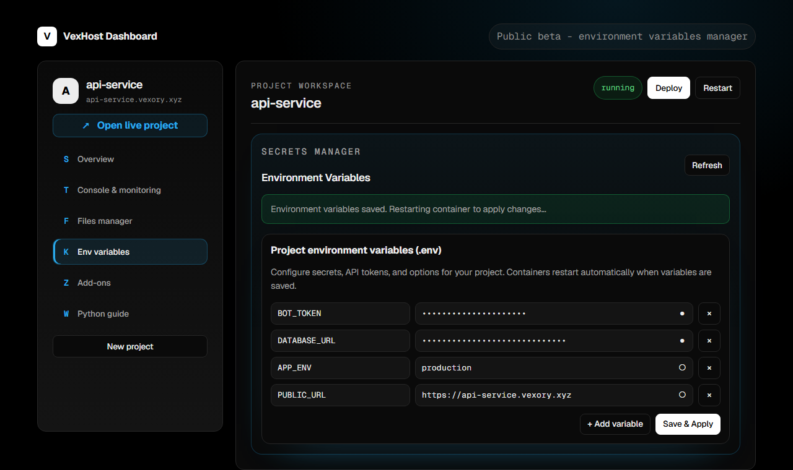
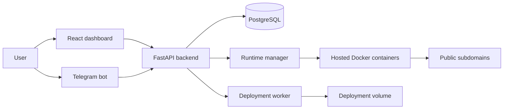

<p align="center">
  
</p>

<h1 align="center">VexHost</h1>

<p align="center">
  <strong>Public beta hosting for websites, APIs, Docker runtimes, Mini Apps, and Telegram bots.</strong>
</p>

<p align="center">
  Deploy from Telegram or the browser, manage files and secrets, watch logs and metrics, and publish to a live subdomain.
</p>

<p align="center">
  <a href="https://host.vexory.xyz/"><strong>Live Beta</strong></a>
  &nbsp;/&nbsp;
  <a href="https://t.me/VexHostBot"><strong>Telegram Bot</strong></a>
  &nbsp;/&nbsp;
  <a href="#quick-start"><strong>Quick Start</strong></a>
  &nbsp;/&nbsp;
  <a href="#screenshots"><strong>Screenshots</strong></a>
</p>

<p align="center">
  
  
  
  
</p>


> **Beta notice**
>
> VexHost is in active development. Features may change, bugs can happen, and the hosted beta may experience temporary downtime. The project is ready for testing, demos, and early feedback, but it is not yet a hardened multi-tenant production platform.

## Table Of Contents

- [Overview](#overview)
- [Screenshots](#screenshots)
- [Highlights](#highlights)
- [Latest Update](#latest-update)
- [Tech Stack](#tech-stack)
- [Architecture](#architecture)
- [Quick Start](#quick-start)
- [Environment](#environment)
- [Services](#services)
- [API Surface](#api-surface)
- [Roadmap](#roadmap)
- [Security Notes](#security-notes)

## Overview

VexHost is a Telegram-first hosting platform for builders who want to launch small projects quickly without managing server plumbing. It combines a public landing page, browser dashboard, Telegram bot access, Docker-based runtimes, live logs, file editing, per-project environment variables, and basic monitoring in one compact stack.

Live beta: [https://host.vexory.xyz/](https://host.vexory.xyz/)

## Screenshots

<table>
  <tr>
    <td width="50%">
      <strong>Landing page</strong>
      <br>
      
    </td>
    <td width="50%">
      <strong>Environment variables manager</strong>
      <br>
      
    </td>
  </tr>
</table>

## Highlights

<table>
  <tr>
    <td><strong>Telegram-first flow</strong><br>Create access from <code>@VexHostBot</code> and manage the same projects from the browser dashboard.</td>
    <td><strong>Real runtimes</strong><br>Run static sites, Node.js apps, Python apps, APIs, Mini Apps, and Telegram bots in Docker containers.</td>
  </tr>
  <tr>
    <td><strong>Built-in file editor</strong><br>Upload files, create folders, edit code, and manage project workspaces directly in the UI.</td>
    <td><strong>Secrets manager</strong><br>Edit per-project <code>.env</code> variables with masking, validation, duplicate-key checks, and automatic runtime restart.</td>
  </tr>
  <tr>
    <td><strong>Logs and metrics</strong><br>Watch deploy steps, runtime logs, CPU, RAM, disk, uptime, requests, errors, and restart state.</td>
    <td><strong>Admin console</strong><br>Review users, projects, queue state, abuse flags, and dangerous runtime actions behind explicit confirmation.</td>
  </tr>
</table>

## Latest Update

This version focuses on safer runtime operations and project configuration.

| Area | What changed |
| --- | --- |
| Environment variables | Added `GET /api/projects/{project_id}/env` and `POST /api/projects/{project_id}/env` for safe project `.env` management. |
| Dashboard | Added an Env variables tab with masked values, add/edit/delete controls, duplicate-key checks, and multiline-value validation. |
| Runtime apply | Saving env vars can automatically schedule a runtime restart so containers pick up changes. |
| Runtime manager | Sensitive runtime-manager endpoints now require a shared backend token. |
| Sessions | Production session signing now requires `AUTH_SECRET` instead of relying on a predictable fallback. |
| Worker queue | Runtime-start jobs are kept out of the static deployment worker to avoid queue races. |

## Tech Stack

| Layer | Tools |
| --- | --- |
| Frontend | React, Vite, Monaco Editor, Lucide icons |
| Web serving | Nginx |
| Backend | FastAPI, SQLAlchemy async, Pydantic Settings |
| Database | PostgreSQL |
| Bot | aiogram |
| Runtime layer | Docker, runtime manager service, worker queue |
| Deployment | Docker Compose |

## Architecture



## Quick Start

### Requirements

- Docker and Docker Compose
- A Telegram bot token for Telegram login and bot features
- A reverse proxy or public network if you want to expose it like the live beta

### 1. Configure

```bash
cp .env.example .env
```

### 2. Start

```bash
docker compose up -d --build
```

### 3. Verify

```bash
curl http://127.0.0.1:8000/healthz
curl https://host.vexory.xyz/healthz
```

## Environment

```env
POSTGRES_USER=vexhost
POSTGRES_PASSWORD=change-me
POSTGRES_DB=vexhost
CORS_ORIGINS=https://host.vexory.xyz
TELEGRAM_BOT_TOKEN=
TELEGRAM_ADMIN_CHAT_ID=
DASHBOARD_URL=https://host.vexory.xyz/?view=dashboard
AUTH_SECRET=
RUNTIME_MANAGER_TOKEN=
```

For production, set strong random values for `AUTH_SECRET` and `RUNTIME_MANAGER_TOKEN`.

## Services

| Service | Purpose |
| --- | --- |
| `web` | Builds the React app and serves it with Nginx. |
| `backend` | Main FastAPI API for auth, dashboard, projects, deployments, files, env vars, runtime controls, and admin actions. |
| `worker` | Processes deployment jobs in the background. |
| `bot` | Telegram bot entry point powered by aiogram. |
| `runtime-manager` | Starts, stops, inspects, and manages hosted Docker runtimes. |
| `db` | PostgreSQL database for users, projects, deployments, and waitlist data. |

## API Surface

| Endpoint | Description |
| --- | --- |
| `GET /healthz` | Backend health check. |
| `GET /api/health` | API health alias. |
| `GET /api/stats` | Basic platform statistics. |
| `GET /api/templates` | Available starter templates. |
| `GET /api/dashboard` | Authenticated dashboard data. |
| `GET /api/projects/{project_id}/env` | Read project environment variables. |
| `POST /api/projects/{project_id}/env` | Save project environment variables and apply them to runtime containers. |
| `GET /api/admin/summary` | Admin overview for users, projects, queues, runtime state, and abuse flags. |

## Project Structure

```text
.
+-- assets/                 # README and GitHub visual assets
+-- backend/                # FastAPI API, worker, bot, runtime manager
|   +-- app/
|   +-- Dockerfile
|   +-- Dockerfile.runtime-manager
+-- frontend/               # React/Vite dashboard and landing page
|   +-- public/             # Favicon and Open Graph preview
|   +-- src/
|   +-- Dockerfile
|   +-- nginx.conf
+-- docker-compose.yml
+-- README.md
```

## Current Beta Scope

- Public landing page and dashboard UI
- Telegram-based account flow
- Project creation and runtime configuration
- Static deployment flow
- Per-project file manager and environment variables manager
- Docker runtime launch, stop, restart, logs, metrics, and health checks
- Admin overview, abuse signals, and dangerous admin actions behind confirmation

## Roadmap

- Harden runtime isolation and quota enforcement
- Improve deployment queue reliability and retry behavior
- Add billing and plan limits
- Add custom domains and TLS automation
- Expand starter templates
- Add stronger automated tests and CI checks
- Improve self-hosting and production-hardening documentation

## Security Notes

- Do not commit `.env` files, Telegram bot tokens, runtime tokens, or session secrets.
- Set strong random values for `AUTH_SECRET` and `RUNTIME_MANAGER_TOKEN` before production use.
- Review Docker socket access before production use.
- Treat runtime execution as sensitive infrastructure.
- Keep admin access limited to trusted accounts.
- This beta is not yet a hardened multi-tenant production platform.

## License

No license has been selected yet. Until a license is added, all rights are reserved by the project owner.
